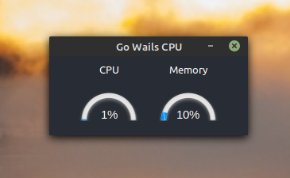

# go-wails-cpu

This repository is a test with Golang + Wails + React

<p align="center">
  
</p>

## How to use?

You can compile with the Wails project and run the application or run the app already compiled in this repository

#### Building

[Wails project](https://github.com/wailsapp/wails)

```
$ wails build
$ ./gowailscpu
```

#### Compiled
```
$ ./gowailscpu
```